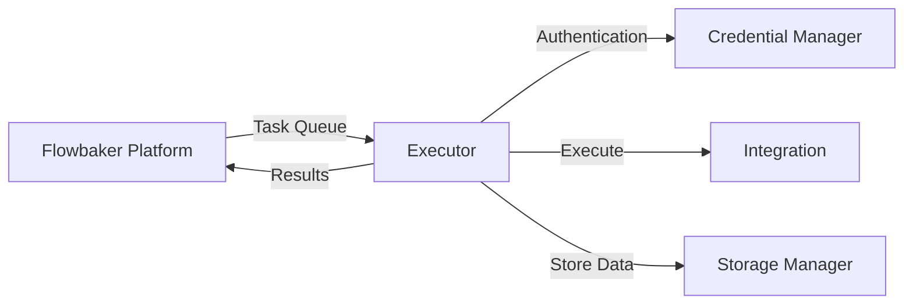

# Executors

Executors are the runtime engines that execute your workflows. They run on your infrastructure, connect to the Flowbaker platform, and process workflow tasks with full access to your integrations and data.

## What is an Executor?

An executor is a standalone application that:

1. **Connects to Workspaces**: Authenticates with your Flowbaker workspaces
2. **Listens for Tasks**: Receives workflow execution requests from the platform
3. **Executes Workflows**: Runs workflow nodes and integrations
4. **Returns Results**: Sends execution results back to the platform

<Info>
Executors run on your own infrastructure, giving you full control over where and how workflows execute.
</Info>

## Architecture



### Core Components

#### Workflow Executor

The `WorkflowExecutor` is responsible for executing individual workflows:

```go
type WorkflowExecutor struct {
    executionID                string
    workflow                   Workflow
    waitingExecutionTasks      []WaitingExecutionTask
    executionQueue             []NodeExecutionTask
    executedNodes              map[string]struct{}
    nodesByEventName           map[string][]WorkflowNode
    executionCountByNodeID     map[string]int
    integrationSelector        IntegrationSelector
    enableEvents               bool
    enableStreaming            bool
    IsTestingWorkflow          bool
    WorkflowExecutionStartedAt time.Time
}
```

Key responsibilities:
- Managing the execution queue
- Tracking executed nodes
- Preventing infinite loops
- Publishing execution events
- Handling errors gracefully

#### Task System

Executors process tasks from a message queue:

```go
type TaskType string

var (
    ExecuteWorkflow  TaskType = "execute_workflow"
    ProcessEmbedding TaskType = "process_embedding"
)

type ExecuteWorkflowTask struct {
    WorkspaceID  string
    WorkflowID   string
    UserID       string
    WorkflowType WorkflowType
    FromNodeID   string
    Payload      any
}
```

The executor listens for these task types and handles them appropriately.

## How Executors Work

### 1. Initialization

When you start an executor for the first time:

```bash
./flowbaker start
```

The executor:
- Generates a unique executor ID
- Prompts you to connect to a workspace
- Creates secure authentication keys
- Establishes a connection to the Flowbaker platform

### 2. Task Listening

Once connected, the executor listens for workflow execution tasks:

```go
type TaskQueueListener interface {
    Listen(ctx context.Context, taskType TaskType, handler TaskHandler) error
}
```

When a workflow is triggered on the platform, an execution task is published to the queue.

### 3. Workflow Execution

The executor processes workflows through these steps:

<Steps>
  <Step title="Initialize Execution Context">
    Create an execution ID, set up observability, and prepare the workflow state.
  </Step>
  
  <Step title="Queue Trigger Node">
    Add the trigger node to the execution queue with the incoming payload.
  </Step>
  
  <Step title="Process Execution Queue">
    Execute nodes from the queue in order, respecting dependencies and execution limits.
  </Step>
  
  <Step title="Execute Each Node">
    For each node:
    - Retrieve integration credentials
    - Bind input data
    - Execute the integration
    - Publish output events
  </Step>
  
  <Step title="Propagate to Downstream Nodes">
    Queue downstream nodes that subscribe to the completed node's output events.
  </Step>
  
  <Step title="Complete Execution">
    When the queue is empty, send execution results back to the platform.
  </Step>
</Steps>

### 4. Result Reporting

After execution completes, the executor reports:

```go
type CompleteExecutionRequest struct {
    ExecutionID       string
    WorkspaceID       string
    WorkflowID        string
    TriggerNodeID     string
    StartedAt         time.Time
    EndedAt           time.Time
    NodeExecutions    []NodeExecution
    HistoryEntries    []NodeExecutionEntry
    IsTestingWorkflow bool
}
```

This includes:
- Execution timeline
- Node-by-node results
- Complete execution history
- Usage metrics

## Executor Managers

Executors use specialized managers to interact with platform services:

### Workspace Manager

```go
type ExecutorWorkspaceManager interface {
    GetWorkspace(ctx context.Context, workspaceID string) (Workspace, error)
    GetWorkspaces(ctx context.Context) ([]Workspace, error)
}
```

Manages workspace connections and metadata.

### Credential Manager

```go
type ExecutorCredentialManager interface {
    GetDecryptedCredential(ctx context.Context, credentialID string) ([]byte, error)
    GetFullCredential(ctx context.Context, credentialID string) (Credential, error)
    GetOAuthAccount(ctx context.Context, oauthAccountID string) (OAuthAccount, error)
    UpdateOAuthAccountMetadata(ctx context.Context, oauthAccountID string, metadata map[string]interface{}) error
}
```

Securely retrieves and manages integration credentials.

### Integration Manager

```go
type ExecutorIntegrationManager interface {
    GetIntegrations(ctx context.Context) ([]Integration, error)
    GetIntegration(ctx context.Context, integrationType IntegrationType) (Integration, error)
}
```

Provides access to available integrations and their configurations.

### Task Publisher

```go
type ExecutorTaskPublisher interface {
    EnqueueTask(ctx context.Context, workspaceID string, task Task) error
    EnqueueTaskAndWait(ctx context.Context, workspaceID string, task Task) ([]byte, error)
}
```

Allows workflows to trigger other workflows or queue background tasks.

### Storage Manager

```go
type ExecutorStorageManager interface {
    // Methods for file and data storage
}
```

Manages persistent storage for workflow data.

### Schedule Manager

```go
type ExecutorScheduleManager interface {
    // Methods for managing scheduled tasks
}
```

Handles cron triggers and scheduled workflow execution.

### Knowledge Manager

```go
type ExecutorKnowledgeManager interface {
    // Methods for accessing knowledge bases
}
```

Provides access to knowledge bases for AI-powered workflows.

### Model Manager

```go
type ExecutorModelManager interface {
    // Methods for AI model access
}
```

Manages AI model integrations and embeddings.

## Execution Safety

Executors implement several safety mechanisms:

### Execution Limits

```go
const DefaultNodeExecutionLimit = 1000

func (w *WorkflowExecutor) getNodeExecutionLimit(node WorkflowNode) int {
    if node.Settings.OverwriteExecutionLimit && node.Settings.ExecutionLimit > 0 {
        return node.Settings.ExecutionLimit
    }
    if w.workflow.Settings.NodeExecutionLimit > 0 {
        return w.workflow.Settings.NodeExecutionLimit
    }
    return DefaultNodeExecutionLimit
}
```

Prevents infinite loops by limiting node executions.

### Error Handling

Executors can handle errors in multiple ways:

1. **Stop Execution**: Default behavior, workflow stops on error
2. **Return Error as Item**: Convert errors to data items for downstream processing
3. **Error Triggers**: Route errors to special error handling workflows

### Context Cancellation

Executors respect context cancellation for graceful shutdowns:

```go
for len(w.executionQueue) > 0 {
    if ctx.Err() != nil {
        return ExecutionResult{}, ctx.Err()
    }
    // ... execute next node
}
```

## Multiple Executors

You can run multiple executors for:

- **High Availability**: If one executor fails, others continue processing
- **Load Distribution**: Distribute workflow execution across multiple machines
- **Geographic Distribution**: Run executors closer to your data sources
- **Environment Isolation**: Separate development and production workloads

<Warning>
Each executor needs its own unique executor ID and workspace connection.
</Warning>

## Executor Commands

The executor CLI provides several commands:

```bash
# Start the executor (auto-setup on first run)
flowbaker start

# Check executor status
flowbaker status

# Reset configuration
flowbaker reset

# Manage workspace connections
flowbaker workspaces
```

## Installation

### Download Binary

Download the latest executor from [GitHub releases](https://github.com/flowbaker/flowbaker/releases).

### Build from Source

```bash
git clone https://github.com/flowbaker/flowbaker.git
cd flowbaker
go build -o flowbaker cmd/main.go
```

**Requirements**: Go 1.25+

## Security

Executors maintain security through:

- **Encrypted Credentials**: All credentials are encrypted in transit and at rest
- **Workspace Isolation**: Each workspace has separate authentication
- **Secure Communication**: TLS-encrypted connections to the platform
- **Local Execution**: Sensitive data never leaves your infrastructure

<Note>
Executors run on your infrastructure, so you maintain full control over data access and security policies.
</Note>

## Monitoring

Executors provide observability through:

- **Execution Events**: Real-time workflow execution updates
- **History Tracking**: Complete execution history for debugging
- **Usage Metrics**: Track resource consumption and performance
- **Stream Events**: Live execution progress for testing workflows

## Next Steps

<CardGroup cols={2}>
  <Card title="Workflows" icon="diagram-project" href="/concepts/workflows">
    Learn how to build workflows
  </Card>
  <Card title="Integrations" icon="plug" href="/concepts/integrations">
    Explore available integrations
  </Card>
</CardGroup>